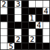

<p align="center">
  
</p>

# A DSL for Puzzles
> This project was produced for the dissertation component of my Computer Science masters at University of Warwick. The accompanying thesis can be found  [here](doc/report.pdf).

The aim of the project is to create an expressive framework for stating and solving simple grid puzzles. It aims to provide:

- [x] A Haskell **DSL** for stating puzzles
- [x] A **solver** for producing solutions
- [ ] A **file format** to state puzzles in plain text
- [ ] A **front end** to enter, inspect and solve puzzles

The project is packaged using IOHK's `haskell.nix` infrastructure, and uses both the `sbv` library and microsoft's `z3` SMT solver under the hood.

The goal of the project is to provide a way to declaratively describe the rules of a puzzle using something close to predicate logic.

# Building
Currently, building the project runs the test suite. This contains unit tests for checking that the language behaves as desired, and other tests to check that specific puzzles can be solved.

## Nix
Ensure that [`nix`](https://nixos.org/) is installed, then run:

```
nix run
```

## Cabal
Ensure that `ghc` 9.2.7 is installed, with a recent version of `cabal` (this can all be done via the [`ghcup`](https://www.haskell.org/ghcup/) utility), then run:
```
cabal run
```

# Aknowledgements
I would like to give thanks to:
- [`IOHK`](https://iohk.io/about/) &mdash; For their robust `haskell.nix` infrastructure
- [`sbv`](https://hackage.haskell.org/package/sbv-10.2) &mdash; For their SMT solving framework
- My supervisor *Alex Dixon* for all his help
